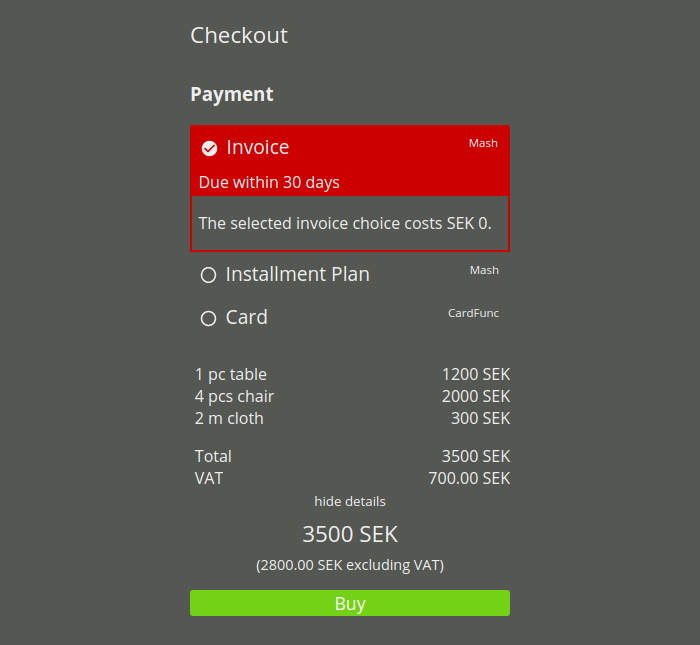
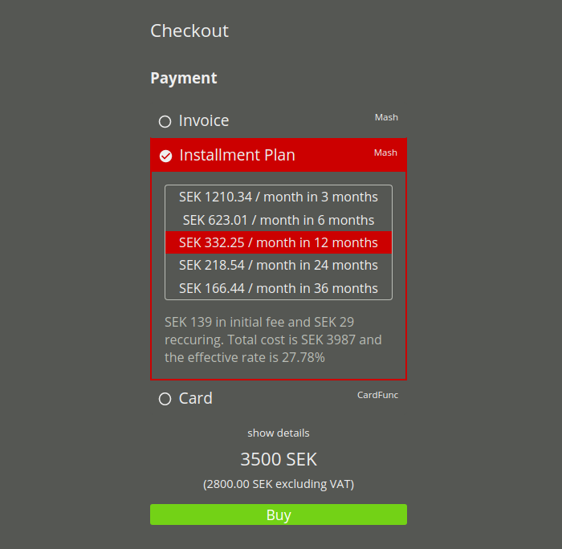
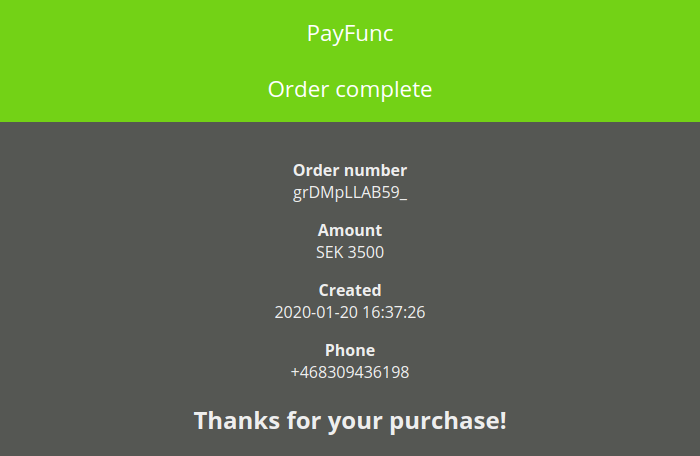

PayFunc Checkout is suited to be the last step of your customer's order process. Once all order items have been selected through other means, PayFunc Checkout allows your customer to select from available payment options and complete the payment.
<!--more-->

# Starting up PayFunc Checkout
When starting up the PayFunc Checkout an order must be included. This order may be more or less detailed. If specifications of ordered items are included, the PayFunc Checkout will show the total amount as default, but a detailed view can be opened with a click.

### Example details

# Payment Methods
All available payment methods that you have decided to include will be displayed above the order details. Some methods may include more than one option to choose from, e.g. installment plans over a shorter or longer period of time. Details for such options can be viewed by selecting them.

### Example options

# Card Payments
If card payment is chosen as the payment method, the customer will enter card data within the window for that option.

# Completing Payment
Once the customer has decided on a payment option and entered any required information, the buy-button will take the customer to an external authentication page corresponding to the chosen payment option.

# Payment Completion
Upon completing payment, your customer will be sent do a page that confirms successful authentication or, in case the authentication is unsuccessful, a page that describes the failure.

### Example confirmation page
