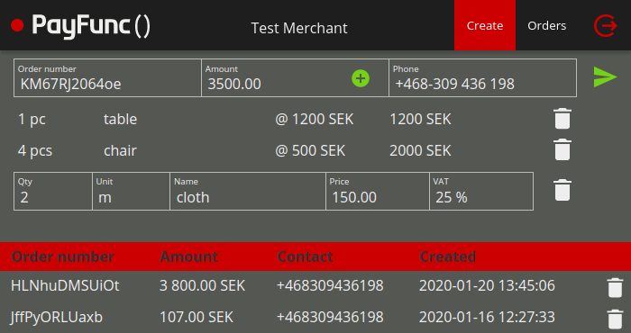
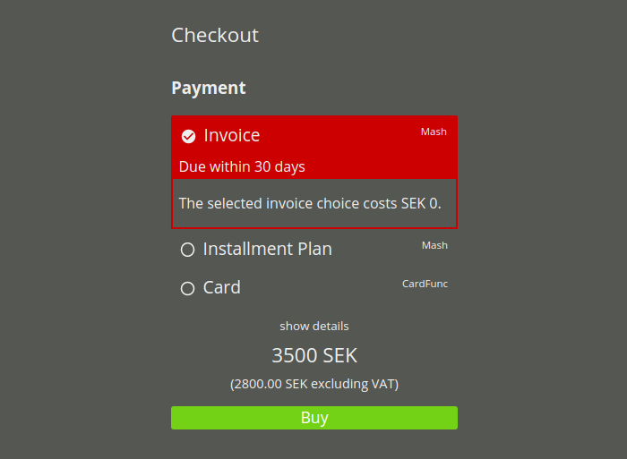
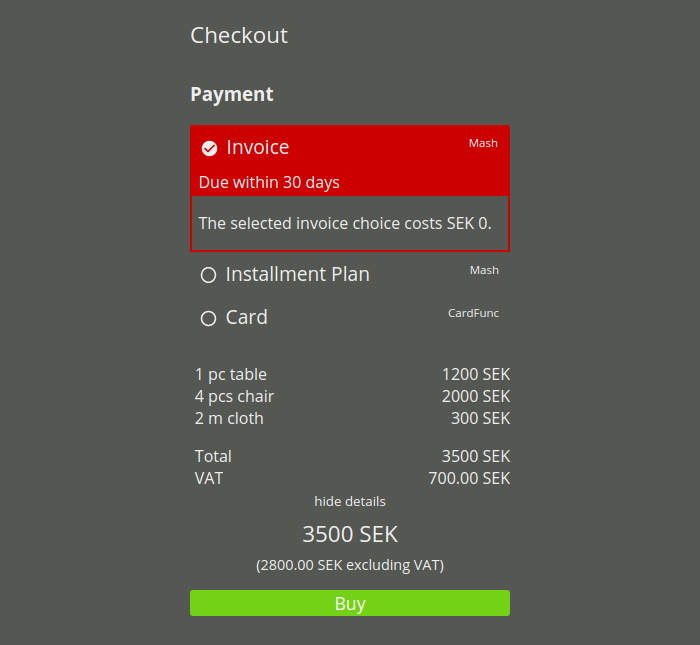

PayFunc Send is a payment solution where a link to PayFunc Checkout is sent to the customer via sms or email.
<!--more-->

# Creating an order
After logging into your account at portal.payfunc.com, you can create a new order, either using a customer's phone number or email address as contact information and either entering the total order amount without specifying details or entering information for every order item.

### Example order creation

# Sending an order
Once all order information has been entered and confirmed, an sms or email containing a link to PayFunc Checkout will be sent to your customer.

# PayFunc Checkout
Clicking on the link will send your customer to PayFunc Checkout, where the order amount and any specification of order items included can be viewed before the customer chooses one of the payment options that your contract includes. Upon completing payment, your customer will be sent do a confirmation page or, in case the chosen payment method is unsuccessful, a page describing the failure.

### Example checkout

### Example checkout details

### Example confirmation page

# Additional order handling
In your account at portal.payfunc.com all orders and their statuses will be listed. You can select one or several orders and perform status changing actions on them, e.g. cancelling an order or marking an order as refunded.

